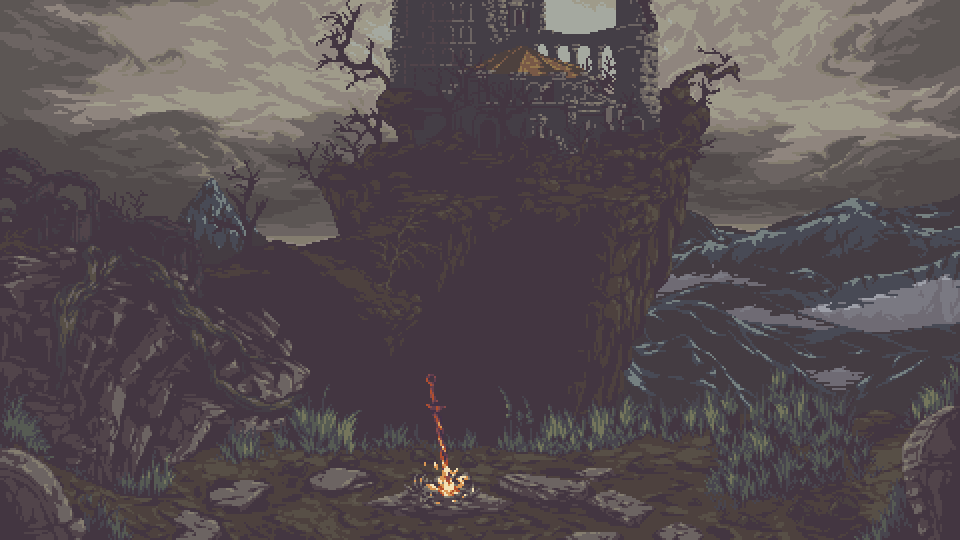

<h1 align="center">Welcome to my profile XD</h1>

  

  <strong>Full Stack Developer in Training</strong> | Back-end | Front-End | REST APIs | Databases

  
  
  

---

## 📋 About me

I am a **Systems Development** student building a solid foundation in web development, with a focus on back-end and software engineering best practices.

**My commitments:**
- ✅ Code organization and readability
- ✅ Layered architecture (routes, controllers, and services)
- ✅ Relational database modeling and persistence
- ✅ Continuous evolution through practical projects

---

## 🛠️ Tech Stack

---

## 🚀 Highlighted Projects

### [Saboré](https://github.com/IsabelleBorges26/Sabore.git)
FullStack platform for sharing and discovering culinary recipes, developed with a layered architecture and software engineering best practices.

**Technologies:** Node.js | React | MySQL | REST API | Prisma | HTML5 | CSS3

---

## 📊 GitHub Stats

  

  

---

## 📊 Technology Distribution

  
  | By Repositories | By Commits |
  |------------------|-------------|
  |  |  |
  
  *Complete view of the technologies used in all projects*
  

---

## 🎯 2026 Goals

- [ ] Deepen **Node.js** knowledge and scalable API development
- [ ] Publish projects with complete **professional documentation**
- [ ] Strengthen **testing** and code quality standards
- [ ] Contribute collaboratively and consistently on GitHub
- [ ] Master **design patterns** and systems architecture

---

## 📞 Contact

- 📧 **Personal Email:** `enzotoniato339@gmail.com`
- 🏫 **Educational Email:** `enzo-toniato331@portalsesisp.org.br`
- 🐙 **GitHub:** [@EnzoToniato567](https://github.com/EnzoToniato567)
- 👤 **Personal GitHub:** [@ViselBrx](https://github.com/ViselBrx)

---

## 💭 Profile Quote

> _"Building consistency every day: study, practice, and evolution in every commit."_

---

  Developed with ❤️ | © 2026

